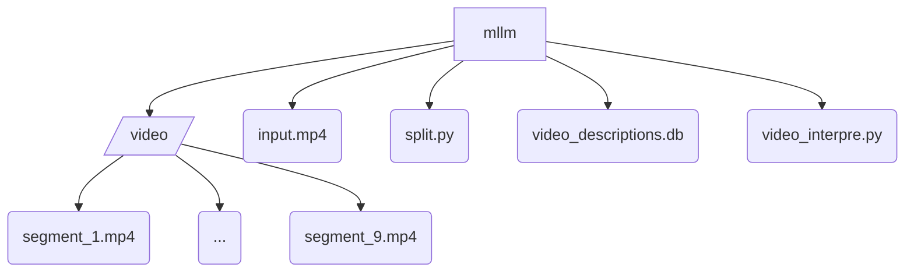

# videoIE
基于qwenvl进行视频信息抽取

# 文件结构

```mermaid
flowchart TD
    A[mllm] --> B[/video/]
    B --> C(segment_1.mp4)
    B --> D(...)
    B --> E(segment_9.mp4)
    A --> F(input.mp4)
    A --> G(split.py)
    A --> H(video_descriptions.db)
    A --> I(video_interpre.py)
```

 # 输入视频

 https://www.bilibili.com/video/BV1Su4y1T7M9/?spm_id_from=333.1387.favlist.content.click
